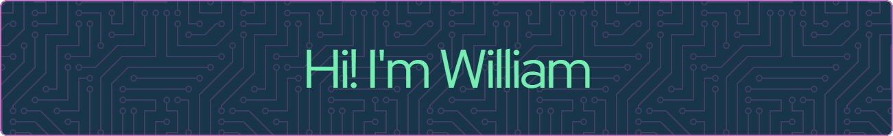

## About Me

In my spare time, I like to tinker with electronics and hoping to delve deeper into robotics.

## Languages and Tools

   

## Stats

<!--
**william-man/William-Man** is a ✨ _special_ ✨ repository because its `README.md` (this file) appears on your GitHub profile.

Here are some ideas to get you started:
&title_color=#fff&text_color=#fff&border_color=#C0A702&bg_color=#035924&border_radius=9
- 🔭 I’m currently working on ...
- 🌱 I’m currently learning ...
- 👯 I’m looking to collaborate on ...
- 🤔 I’m looking for help with ...
- 💬 Ask me about ...
- 📫 How to reach me: ...
- 😄 Pronouns: ...
- ⚡ Fun fact: ...
-->
